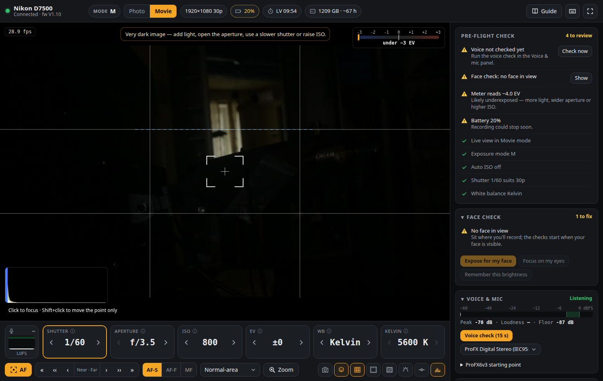

# Nikon Remote

Live preview and full remote control of a USB-tethered **Nikon D7500**, built for recording YouTube videos on your own. You sit in front of the camera, glance at the PC, and see and fix every setting from there: exposure, white balance, focus, frame rate, audio and more. There's a **pre-flight check** that flags anything likely to ruin a take.



## Features

- **Face check:** finds you in the preview and judges exposure on your *face* (the camera's meter is fooled by a dark background). It also checks focus on your eyes, framing (eyes on the upper third), and how many stops darker the background is. **Expose for my face** sets ISO for you, and **Focus on my eyes** runs autofocus on your eyes.
- **Audio tab: set up a Mackie ProFX6v3 by ear-free numbers.** The app listens to the mixer's USB feed. In 4 steps it shows the Mic/Line 1 strip drawn with **exactly** where each control goes: GAIN set live while you talk, then LOW CUT in/out and HI/LOW as clock positions, fitted to your voice. It also gives **OBS compressor/limiter/gate settings**, because the ProFX6v3 has no compressor; they're simulated on your own voice to hit −16 LUFS. Speech detection uses WebRTC VAD, loudness uses pyloudnorm (BS.1770), and the EQ and compressor are simulated with Spotify's pedalboard.
- **Bottom audio bar:** live level with a target zone, LUFS, noise floor and the current GAIN hint, readable from your chair.
- **Session warnings:** the camera's live view auto-off countdown (it cuts the HDMI feed; one-click reset), camera battery minutes left, PC disk minutes left, and mic clipping or no signal.
- **Live preview** at about 25–30 fps. In movie mode it shows the real exposure. Click anywhere to focus there.
- **Dials** for shutter, aperture, ISO, EV, white balance and Kelvin. Use the arrows, the mouse wheel, or the keyboard, or click a value to see the full list. Each dial has an ⓘ that explains it in plain language.
- **Focus bar:** AF, Near/Far nudges in three sizes, AF-S / AF-F / MF, AF-area mode, and zoom from 25% to 200% for checking focus.
- **Overlays:** zebras, focus peaking, histogram, level (from the camera's tilt sensor), rule-of-thirds grid, safe areas, the camera's AF box and exposure meter.
- **Pre-flight check:** Lv switch, exposure mode, Auto ISO, shutter vs frame rate, white balance, meter, mic, battery, card, camera clock, and whether you still match the preset you applied. Most items have a one-click fix.
- **Presets:** built-in *talking head, dark background* setups for day and night. You can also save your own. They're stored in `~/.config/nikon-remote/presets.json`.
- **Every setting:** Exposure / Image / Video & audio / Setup tabs, plus *All settings*, a searchable list of all 238 properties the camera exposes.
- **Two-way sync:** changes you make on the camera body show up in the app within about a second.
- **Resilient:** the app reconnects by itself after a USB hiccup without disturbing a take in progress, and it unmounts GNOME's automatic camera mount for you.
- **Built-in guide** (the *Guide* button) covering the recording workflow and every term.

## Install

Requires Linux with PipeWire (for the mic coach), [uv](https://docs.astral.sh/uv/), and Google Chrome, Chromium or Brave for the app window.

```bash
git clone https://github.com/deniswsrosa/nikon-remote.git
cd nikon-remote
uv sync
./scripts/install-desktop.sh     # adds "Nikon Remote" to your app menu
```

Your user needs access to the camera's USB device. Ubuntu grants it through `libgphoto2`'s udev rules; if the app says *access denied*, install `libgphoto2-6` (or `gphoto2`) and replug the camera.

## Run

| How | Command | Closes when |
|---|---|---|
| **App menu** | *Nikon Remote* | you close its window: live view stops and the camera is released |
| Desktop mode from a terminal | `uv run nikon-remote-app` | same |
| Browser tab / server only | `uv run nikon-remote` | Ctrl+C |
| Control from a phone on your Wi-Fi | `uv run nikon-remote --lan` | Ctrl+C |

Close Entangle, gphoto2 or anything else that might be using the camera first. Only one program can talk to it at a time.

## Recording workflow (HDMI capture card + mic into the PC)

1. On the camera: Lv switch on **movie**, a charged battery (or the EP-5B + EH-5c mains adapter), and HDMI to the capture card.
2. Open Nikon Remote and **apply a preset** that matches your light.
3. Sit in position. Press **Focus on my eyes**, then **Expose for my face**. Once your face looks right, **Remember this brightness** saves that as your target.
4. **Audio tab**: follow the 4 steps. Set the starting position, set GAIN live, analyse 15 s of your voice, set LOW CUT/HI/LOW to the drawn positions, then check again. Add the OBS filters it lists.
5. Make sure the **pre-flight check** is green. Reset the live view timer (⏱ chip) right before a long take.
6. Record in your capture software (e.g. OBS at 1920×1080, 30 fps).

If you record to the camera's card instead, switch **Setup → I record on → Camera card**. The D7500 only starts a card recording from its own ● button.

### Capture card notes (UGREEN 15390)

- It delivers at most **1920×1080 at 60 fps or 2560×1440 at 30 fps** to the PC. It accepts a 4K signal but can't capture 4K, so keep the camera at 1080p30. That uses the full sensor width and keeps Active D-Lighting available; 4K would crop 1.5×.
- These camera settings can't be changed over USB, so set them in the menus once: *Setup → HDMI → Output resolution: 1080p*; *HDMI → Advanced → Live view on-screen display: Off* (clean feed); *Custom setting c3 → Power off delay → Live view:* as long as possible.

See [docs/user-guide.md](docs/user-guide.md) for the full guide, including how to get a dark background.

## Built-in presets

All three are for a developer talking to camera with a mic and a dark background: M, 1080p 30p High quality, 1/60, f/3.5, Auto ISO off, EV 0, center-weighted metering, Neutral Picture Control, Active D-Lighting off, AF-S + Normal-area, e-VR off.

| Preset | ISO | White balance | Light |
|---|---|---|---|
| Talking head · Day (window light) | 400 | 5500 K | daylight from a window |
| Talking head · Night (LED video light) | 800 | 5600 K | daylight-balanced LED key light |
| Talking head · Night (warm lamps) | 1600 | 3200 K | household bulbs / desk lamp |

ISO is only a starting point: tune it to your light. The drift check ignores ISO for that reason.

## Tests

```bash
uv run pytest
```

These cover loudness calibration against the BS.1770 reference, the live GAIN hint, the ProFX6v3 advice on a synthetic voice with known problems (quiet, clipping, one-sided, boomy, dull), the OBS chain hitting −16 LUFS, and *Expose for my face* converging on a simulated camera.

## Keyboard

`R` record · `F` autofocus · `[` `]` focus fine · `{` `}` focus coarse · `Z` zoom · `G` grid · `S` safe areas · `E` zebras · `P` peaking · `L` level · `A` face overlay · `H` histogram · `1`–`6` pick a dial · `←` `→` change it · `?` shortcuts

## Known limitations (D7500)

- **Live view turns off about 10 minutes after it starts** (with the current c3 setting), and the HDMI feed goes with it. Camera commands don't reset the timer; only restarting live view does. The app shows the countdown and has a one-click reset (1–2 s blackout).

- **The PC can't start a recording.** The camera answers `InvalidStatus` to Nikon's `StartMovieRecInCard` whenever the PC runs live view: blocker bit 14, "not in application mode". The setting that should clear this (ApplicationMode, `0xD1F0`) is refused by the D7500. Every combination was tested: photo or movie Lv, PC-control mode on or off, the selector set before or after live view, and the shutter-release route. Start and stop takes with the camera's ● button.
- The 1080p/720p frame-rate labels follow the D850 table in libgphoto2. The 4K vs full-width grouping is verified on the camera; the individual frame rates are not.
- Live view drains the battery quickly. Use the mains adapter for long sessions.

## How it works

```
Browser / app window ──WebSocket──▶ FastAPI (server.py) ──▶ CameraService thread (camera.py) ──PTP/USB──▶ D7500
                     ◀─ JPEG frames + JSON state ─┘                        ptp.py (pyusb)
```

- `nikon_remote/ptp.py` is a small PTP-over-USB client with Nikon's vendor operations. It talks to the camera directly instead of through libgphoto2, because libgphoto2 discards the live view header. That header carries the AF box, display area and zoom, the tilt angles and the remaining clip time.
- `nikon_remote/camera.py` has one thread that owns the USB session. It fetches frames (capped at 30 fps, duplicates dropped), polls camera events, reads status once a second, re-reads settings round-robin as a safety net, and runs commands. Autofocus and focus drive don't block, so the preview keeps moving.
- `nikon_remote/face.py` does face detection (OpenCV YuNet, `models/`, about 5 ms per frame) and measures face exposure, eye sharpness, framing and background separation. `assist.py` runs it about 3× a second and drives *Expose for my face* (damped ISO steps). It also computes the battery and disk estimates.
- `nikon_remote/audio.py` streams the mixer through PipeWire (`pw-record`). It meters peak, K-weighted loudness, noise floor and balance, gives the live GAIN hint and captures speech for the analysis.
- `nikon_remote/mixer.py` turns captured speech into ProFX6v3 settings. WebRTC VAD finds the speech, pyloudnorm measures loudness, and a grid search over LOW/HI/LOW CUT fits the voice's third-octave spectrum to the target (built-in, or a reference clip you upload). The OBS compressor and limiter are then simulated with pedalboard. It follows the controls in Mackie's owner's manual: no compressor, 2-band EQ, stereo-pan *switch*, and USB taken before MAIN MIX.
- `nikon_remote/catalog.py` defines what each property means, its labels, help text and scope (movie/photo), and holds the built-in presets.
- `nikon_remote/server.py` streams frames over a WebSocket with per-client flow control, so a slow browser never builds up lag.
- `nikon_remote/desktop.py` runs the server and a Chrome `--app` window with a private profile, and shuts everything down when that window closes.
- `nikon_remote/static/` is the UI: plain HTML/CSS/JS with no build step. Overlays are computed on a canvas in the browser.

[docs/d7500-ptp-notes.md](docs/d7500-ptp-notes.md) records everything verified on the real camera: property codes, value tables, header layout and quirks.
